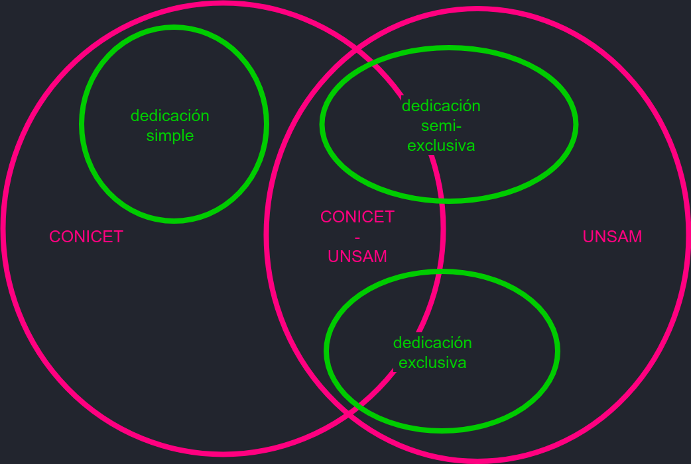

# Gestor de investigadores y becarios

[[toc]]

## Definiciones

### Investigadores



- UNSAM: investigador con dedicación semi-exclusiva o exclusiva en docencia.
- CONICET: investigador de carrera CONICET con cargo de dedicación simple en docencia o sin cargo docente.
- CONICET-UNSAM: investigador de carrera CONICET con dedicación semi-exclusiva o exclusiva en docencia.

### Becarios (Estudiantes de posgrado)


<!-- $\forall BU \in EPU$ -->

- Estudiantes de posgrado: estudiantes que realizan un doctorado o posdoctorado en alguna carrera acreditada por la CONEAU.
- BECARIOS UNSAM: perciben una beca de doctorado o posdoctorado financiada por UNSAM o alguna de sus dependencias.
- BECARIOS CONICET: perciben una beca financiada por CONICET con lugar de trabajo en UNSAM.
- BECARIOS CONICET-UNSAM: perciben una beca cofinanciada por CONICET Y UNSAM.
- BECARIOS ANPCYT: son miembros de un proyecto otorgado a UNSAM y financiado por ANPCYT. Deben ser estudiantes de posgrado de una carrera acreditada por la CONEAU, su director debe ser miembro del grupo no necesariamente con lugar de trabajo en UNSAM.

### Otros cargos

- SIMPLES-UNSAM: docente con dedicación simple que realiza alguna ACYT.
- CPA-CONICET: personal de apoyo CONICET.
- OTROS CARGOS ACYT: personal sin cargo docente, contratados, becarios CIN, etc.

## Archivos

| ARCHIVO                      | ORIGEN                            | DATOS                                                                                                                                                                        | NOMBRE EN BASE DE DATOS |
| ---------------------------- | --------------------------------- | ---------------------------------------------------------------------------------------------------------------------------------------------------------------------------- | ----------------------- |
| BECARIOS-UNSAM.csv           | datos sacados de listas de Romina | dni, cuil, apellido, nombre, convocatoria, unidad                                                                                                                            | personal_becariosunsam  |
| CONICET-UNSAM.CSV            | datos que otorgó Ract             | cuil, apellido, nombre, escalafon                                                                                                                                            | personal_conicet        |
| DEDICACION-UNSAM-DIC2016.CSV | datos de Sec Academica            | legajo, apellido, nombre, cargoId, dni, cuil, dependencia, sede, dedicacion, porcentaje, estado, antiguedad, caracter, planta, categoria, fechaAlta, fechaBaja, contratacion | personal_docentes       |
| PERSONALCORRECCIONUUAA.CSV   | correcion a mano de UUAA          | cuil, apellido, nombre, unidad                                                                                                                                               | personal_correccionuuaa |

## Datos

1. Memoria 2016 (/lib/personal): define el personal informado por UUAA.
2. personal_conicet (pouchGib): agrega escalafon.
3. personal_becariosunsam: agrega info de becarios no conicet.
4. personal_correccionuuaa: agrega la UUAA a los que falta identificar.
5. personal_docentes: agrega info de dedicacion docente.
6. personal_categorizados (pouchUpdateCategorizados): agrega info de categorizacion.
7. personal_conicetnominaweb

1 + 2 + 3 = listado total de personas.

## Types

```javascript
const escalafon =
  'INVESTIGADOR_CONICET' ||
  'INVESTIGADOR_CONICET_UNSAM' ||
  'INVESTIGADOR_UNSAM' ||
  'BECARIO_CONICET' ||
  'BECARIO_CONICET_UNSAM' ||
  'BECARIO_UNSAM' ||
  'BECARIO_ANPCYT' ||
  'CPA_CONICET' ||
  'SIMPLE_UNSAM' ||
  'OTRO_CARGO_ACYT'
```

## Prototype

```javascript
gibPrototype = {
  gib: {
    fecha: 'now',
    memoria: {
      status: true,
      email: '',
      unidad: '',
      usuario: ''
    },
    personal_conicet: {
      status: true,
      escalafon: ''
    },
    // personal_conicetnominaweb: {
    //   status: true,
    //   escalafon: '',
    //   unidad: '',
    //   organizacion_id: ''
    // },
    personal_becariosunsam: {
      status: true,
      convocatoria: '',
      unidad: ''
    },
    personal_docentes: {
      status: true,
      cargos: [
        {
          legajo: '',
          dependencia: '',
          sede: '',
          dedicacion: '',
          estado: '',
          antiguedad: '',
          caracter: '',
          categoria: '',
          fechaAlta: '',
          fechaBaja: ''
        }
      ]
    },
    personal_categorizados: {
      status: true,
      categoria: '',
      anio: ''
    },
    personal_correccionuuaa: {
      status: true,
      unidad: ''
    }
  },
  cuil: '',
  apellido: '',
  nombre: '',
  unidad: '',
  escalafon: '',
  categoria: '',
  cargo: ''
}
```
