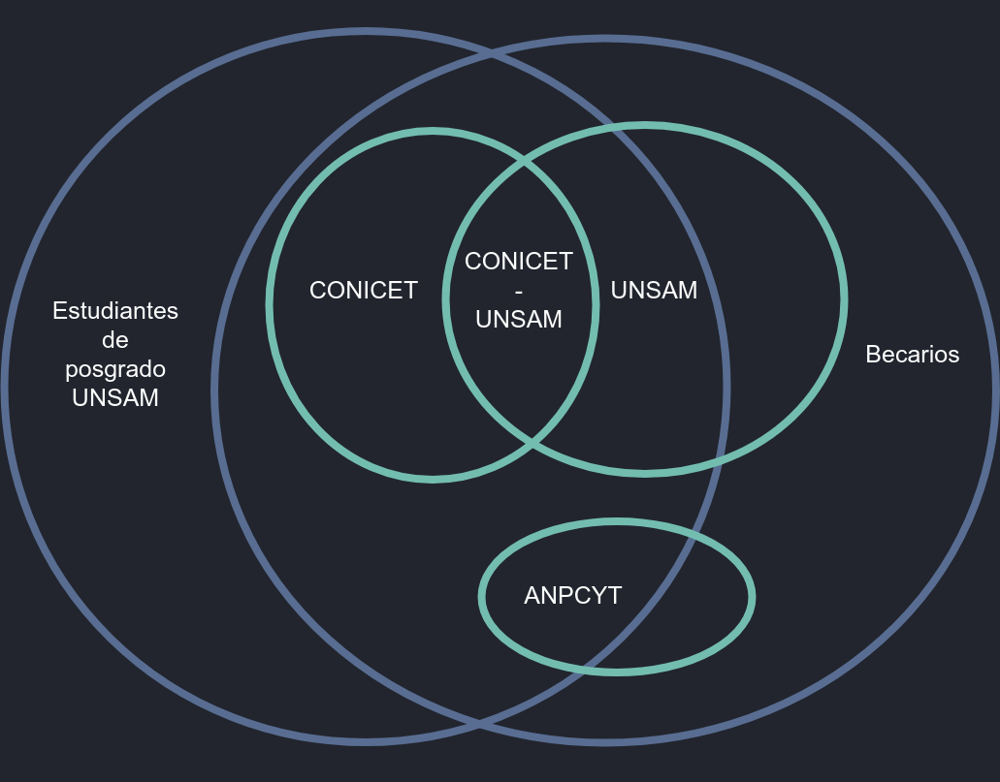

# Gestor de investigadores y becarios

[[toc]]

## Definiciones

### Investigadores

- UNSAM: investigador con dedicación semi-exclusiva o exclusiva,
- CONICET: investigador CONICET con dedicación simple.
- CONICET-UNSAM: investigador CONICET con dedicación semi-exclusiva o exclusiva.

### Becarios

- Estudiantes de posgrado: estudiantes que realizan su doctorado o posdoctorado en UNSAM. Si bien no reciben una beca acreditada en UNSAM hacen uso de las instalaciones e insumos y denotan pertenencia a la ACYT.
- UNSAM: perciben una beca de doctorado o posdoc financiada por UNSAM o alguna de sus dependencias.
- CONICET: perciben una beca financiada por CONICET con lugar de trabajo en UNSAM.
- CONICET-UNSAM: perciben una beca cofinanciada por CONICET Y UNSAM.
- ANPCYT: son miembros de un proyecto otorgado a UNSAM y financiado por ANPCYT. Deben ser estudiantes de posgrado de una carrera acreditada por la CONEAU, su director debe ser miembro del grupo no necesariamente con lugar de trabajo en UNSAM.

### Otros cargos

- SIMPLES-UNSAM: docente con dedicación simple o personal sin dedicación que realiza alguna ACYT.
- CPA-CONICET: personal de apoyo CONICET.

## Archivos

| ARCHIVO                      | ORIGEN                            | DATOS                                                                                                                                                                        |
| ---------------------------- | --------------------------------- | ---------------------------------------------------------------------------------------------------------------------------------------------------------------------------- |
| BECARIOS-UNSAM.csv           | datos sacados de listas de Romina | dni, cuil, apellido, nombre, convocatoria, unidad                                                                                                                            |
| CONICET-UNSAM.CSV            | datos que otorgó Ract             | cuil, apellido, nombre, escalafon                                                                                                                                            |
| DEDICACION-UNSAM-DIC2016.CSV | datos de Sec Academica            | legajo, apellido, nombre, cargoId, dni, cuil, dependencia, sede, dedicacion, porcentaje, estado, antiguedad, caracter, planta, categoria, fechaAlta, fechaBaja, contratacion |
| PERSONALCORRECCIONUUAA.CSV   | correcion a mano de UUAA          | cuil, apellido, nombre, unidad                                                                                                                                               |

## Orden de precedencia

1. Memoria 2016 (/lib/personal): define el personal base.
2. CONICET-UNSAM y NOMINA CONICET WEB (pouchGib): agrega escalafon.
3. BECARIOS-UNSAM: agrega info de becarios no conicet.
4. DEDICACION-UNSAM: agrega info de dedicacion docente.
5. Categorizados (pouchUpdateCategorizados): agrega info de categorizacion.
6. PERSONALCORRECCIONUUAA: agrega la UUAA a los que falta identificar.
