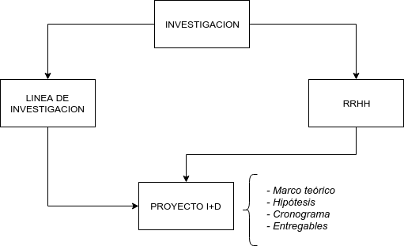

# Memoria

## Descripción

La Memoria de I+d+i+t (investigación, desarrollo, innovación y transferencia) define el contorno de la ACyT. Puede ser usada como informe personal para evaluar las condiciones a cumplir por los recursos humanos para ser considerados parte de la actividad y como informe institucional que describa la actividad acotada a un período determinado.

- LINEA DE INVESTIGACION: grupo conformado de manera asociativa con una continuidad temática y temporal.
- RRHH: Investigadores, becarios y personal que generara conocimiento.
- PROYECTO I+D: concreción de una linea de investigación eventual y sujeto a una convocatoria.

### Investigación

| Publicaciones científicas      | Fuente       | Comentario                  |
| ------------------------------ | ------------ | --------------------------- |
| Artículos con referato         | SIGEVA-UNSAM |                             |
| Artículos en SCOPUS            | SCOPUS       | Buscar metadatos con el DOI |
| Trabajos en eventos publicados | SIGEVA-UNSAM |                             |
| Libros                         | SIGEVA-UNSAM |                             |
| Capítulos de libro             | SIGEVA-UNSAM |                             |

| Producción artística | Fuente | Comentario |
| -------------------- | ------ | ---------- |
| Publicaciones        |        |            |
| Escénicas            |        |            |
| Multimedial          |        |            |

| Formacíon de RRHH                       | Fuente             | Comentario                                |
| --------------------------------------- | ------------------ | ----------------------------------------- |
| Becarios de doctorado                   | GIB                | Hay que recabar directores y codirectores |
| Becarios de posdoctorado                | GIB                | Hay que recabar directores y codirectores |
| Estudiantes de posgrado sin beca        | Académicas         | tesistas                                  |
| Estudiantes de posgrado internacionales | Internacionales    | outbound inbound                          |
| Títulos de posgrado expedidos           | Biblioteca Central | Tesis                                     |

| Grupos de investigación                       | Fuente                                                   | Comentario                                        |
| --------------------------------------------- | -------------------------------------------------------- | ------------------------------------------------- |
| Líneas de investigación                       | incierta                                                 | Ver web, centros, núcleos, programas, grupos, etc |
| Proyectos de I+D                              | Financiamiento CyT/Proyecto I+D/inv basica, inv aplicada | PICT, PIP, UNSAM, INTERNACIONALES                 |
| Subsidios para infraestructura y equipamiento |                                                          | ARSET                                             |
| Subsidios para eventos de CyT                 |                                                          | asistencia / organizacion                         |

### Innovación

| Desarrollos              | Fuente                                                                | Comentario                                      |
| ------------------------ | --------------------------------------------------------------------- | ----------------------------------------------- |
| Desarrollos tecnológicos | Financiamiento CyT/Proyecto I+D/desarrollo experimental o tecnologico | START-UP, SPIN-OFF, EMPRETECNO, AGREGANDO VALOR |

### Transferencia

| Productos   | Fuente | Comentario                          |
| ----------- | ------ | ----------------------------------- |
| Patentes    |        | ¿solicitadas u otorgadas?           |
| Tecnologías |        | Asociado a la explotación comercial |

| Capacidades transferibles | Fuente | Comentario                                             |
| ------------------------- | ------ | ------------------------------------------------------ |
| Acuerdo de I+D            |        | Investigación contratada, Investigación colaborativa   |
| Consultoría               |        | Apoyo técnico o asistencia técnica o informes técnicos |
| Servicios                 |        | Ligado al uso de equipamiento o instalaciones          |
| Movilidad                 |        | Estancias de investigadores en empresas                |
| Cursos de capacitación    |        |                                                        |

| Divulgación                                        | Fuente       | Comentario                 |
| -------------------------------------------------- | ------------ | -------------------------- |
| Comunicación pública de la ciencia y la tecnología | SIGEVA-UNSAM | Actividades de divulgación |
| Trabajos en eventos no publicados                  | SIGEVA-UNSAM | Congresos                  |
| Demás producciones                                 | SIGEVA-UNSAM | x                          |

### Infraestructura

| Infraestructura | Fuente | Comentario |
| --------------- | ------ | ---------- |
| Instalaciones   |        |            |
| Equipamiento    |        |            |

### Indicadores

## Investigadores

- UNSAM: Tiene dedicación Exclusiva o Semiexclusiva o dos dedicaciones simples dentro de la misma Unidad Académica.
- CONICET: Carrera de investigador CONICET con lugar de trabajo en UNSAM, tienen dedicación simple o ninguna actividad docente.
- UNSAM-CONICET: Carrera de investigador CONICET con lugar de trabajo en UNSAM, tienen dedicación exclusiva o semiexclusiva.
- ASOCIADO: Hace alguna ACyT pero no recibe un estipendio en caracter por parte de la UNSAM que justifique dicha actividad. Tiene título de doctorado, participa de proyectos I+D acreditados en la UNSAM, forma RRHH y tiene producción científica comprobable. Puede tener categoría I, II o III del programa de incentivos. Puede realizar investigación en CNEA, INTI o INTA.

| #   | CONDICIONES PRIMARIAS (DE CONTRATACIÓN) | Comentario                                                                                              |
| --- | --------------------------------------- | ------------------------------------------------------------------------------------------------------- |
| 1   | Cargo docente en UNSAM                  | Dedicación exclusiva, semiexclusiva o dos dedicaciones simples dentro de la misma unidad académica.     |
| 2   | Cargo de investigador CONICET           | Con lugar de trabajo en UNSAM.                                                                          |
| x   | Contrato como investigador              | **PROPUESTA** Personal que se les paga un contrato para investigar, por ejemplo los que están jubilados |

| #   | CONDICIONES SECUNDARIAS (DE MÉRITO)             | Comentario                                              |
| --- | ----------------------------------------------- | ------------------------------------------------------- |
| 1   | Categoría en el programa de incentivos          | I, II o III                                             |
| 2   | Director o codirector de estudiante de posgrado | Doctorado o posdoctorado en UNSAM                       |
| 3   | Miembro de Proyecto I+D acreditado              | PICT, PIP, UNSAM(todos), INTERNACIONALES                |
| 4   | Artículos con referato (SCOPUS U OTRO)          | Por lo menos 2 en quinquenio sin importar la afiliación |
| 5   | Libros con referato                             | Por lo menos 1 en quinquenio sin importar la afiliación |

--
| 6 | Certificacion de Unidad Academica | **PROPUESTA** / Asociados IDAES por consejo de instituto |
| x | Capacidades transferibles | **PROPUESTA** Tecnólogos |

::: tip Aclaración
Una persona es considerada **INVESTIGADOR** sí y solo sí por lo menos cumple con una condición primaria y una condición secundaria.
Es considerada **INVESTIGADOR ASOCIADO** si sólo cumple con una condición secundaria.
:::

## AREAS

1. CIENCIAS NATURALES Y EXACTAS
   1.1 Matemáticas
   1.1.1 Matemática Pura
   1.1.2 Matemática Aplicada
